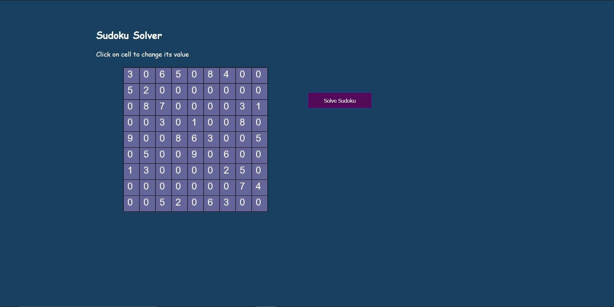
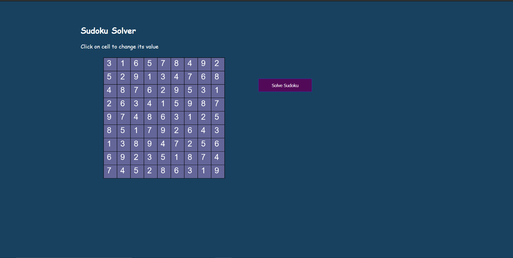
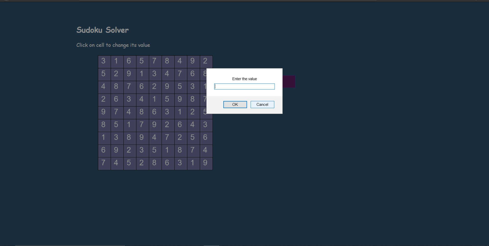

# Sudoku Solver

The Sudoku solver makes life easier for Sudoku geeks. The computation power of the machine is used to solve the hardest of Sudoku's. The web application is 
* User Interface of Sudoku Solver

* Result of Sudoku Solver

* Input to cells.  

## The p5.js is used to draw cells on the canvas. 

## BackTracking Algorithm 
* Link for understanding backtracking (https://www.geeksforgeeks.org/backtracking-algorithms/) 
* The backtracking algorithm from DATA STRUCTURES AND ALGORITHMS is used to solve the sudoku. 
*  It tries every possible value from 1-9 and tries to fill the sudoku. 
*  However if there is some constraint unsatisfiability then next value is tried and so on till it reached the end with a constraint satisfiable solution.
* If it does not find a solution it alerts the user that no solution is possible.
* Otherwise the output is filled in the sudoku.
